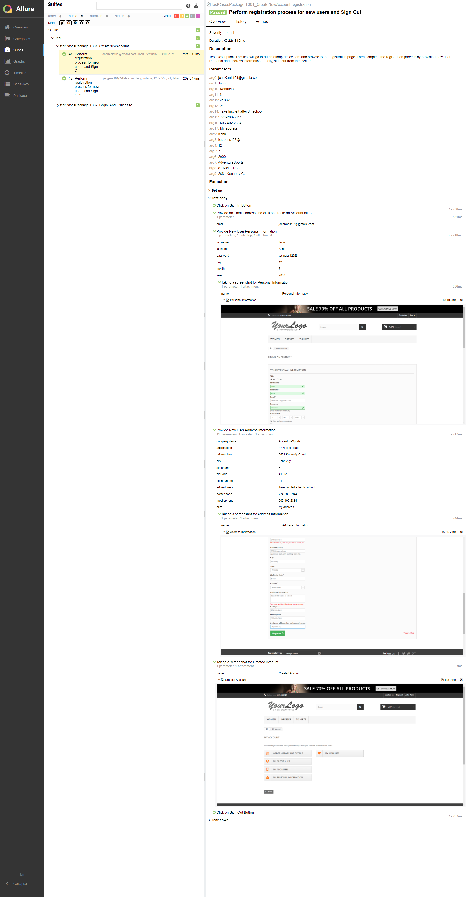

# BrainStation23-AUTOMATION-TASK-2022
# [Live Allure Report](https://arfoysal-bs23-automation-task-2022.netlify.app/)
## Link: https://arfoysal-bs23-automation-task-2022.netlify.app/

## Report Screenshot 
- summary

- Create new Account 

- Login and Purchase


## Technology used
  
- Test tool:  Selenium Webdriver 
- Language: Java  
- Architecture: POM
- Framework: TestNG
- IDE: Eclipse  

## Pre Requisites:
  
- Open/install Java JDK 8 or Later version on your PC  
- Install Maven on your PC   
- Install Eclipse/STS or any other IDE  
- Setup Java, Maven environment on your PC  
- Chrome Browser

## Requirements:
- Set Configure build path libraries with JRE System Library 1.8 or above 
- Goto to testDataPackage and open DataSet.java file...  
```
    Edit email data for every user data for every run 
    johnKanir101@gmalla.com  update like johnKanir102@gmalla.com
    jacyjane101@dffda.com  update like jacyjane102@dffda.com 
``` 
## How to Run the script:
- Right Click on testng.xml file
- Then select Run as TestNG

## Authors

- [@arfoysal](https://www.github.com/arfoysal)